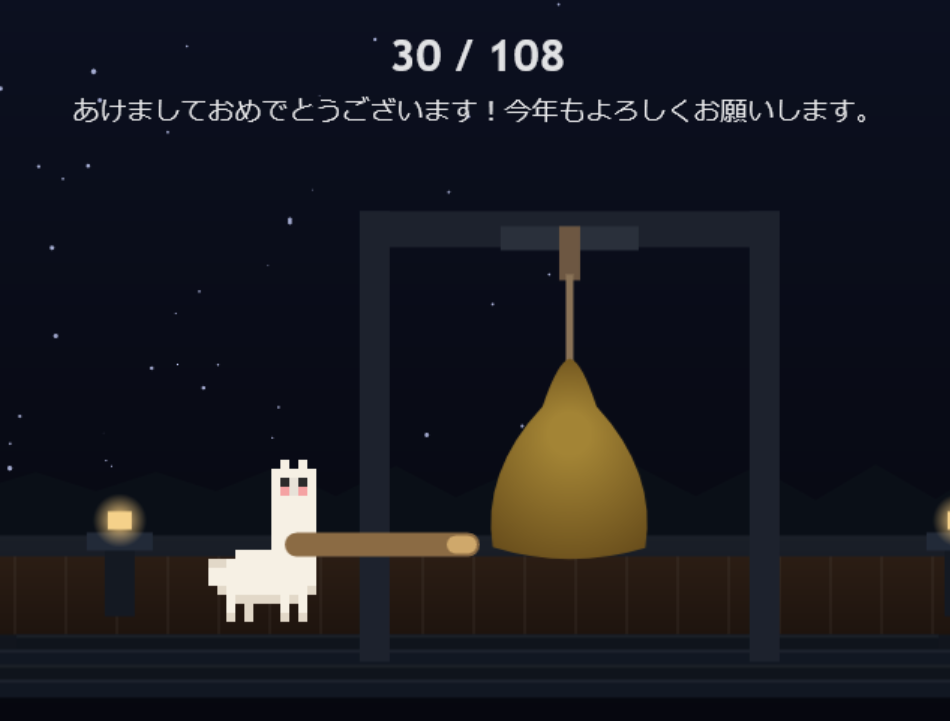

# 108 

## / Overview
Webサイト上でアルパカが鐘を108回鳴らすアニメーションが完了すると、フラグが表示される仕組みのWeb問題。

## / Writeup

### 解法1
時間が経つのを待つ。

### 解法2
`index.html`のソースコードのスクリプトタグ内に次のような関数がある。

```js
function loadFlag() {
  const t = document.cookie.split(";").map((t => t.trim())).find((t => t.startsWith("flag=")));
  if (!t) throw new Error("Flag cookie missing");
  if (FLAG = decodeURIComponent(t.split("=")[1] || ""), 108 !== FLAG.length) throw new Error(`FLAG length must be 108, got ${FLAG.length}`)
}
```

フラグはすでにクライアント側のクッキー情報に保存されていることが分かるので、開発者ツールからクッキーの中身を確認してフラグゲット。

## おまけ

