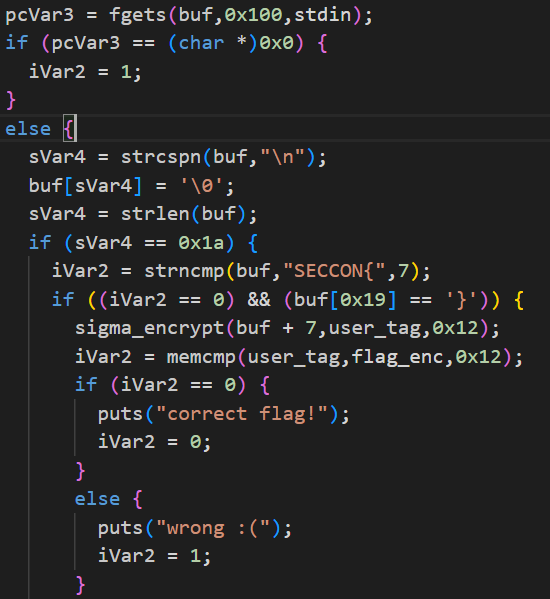
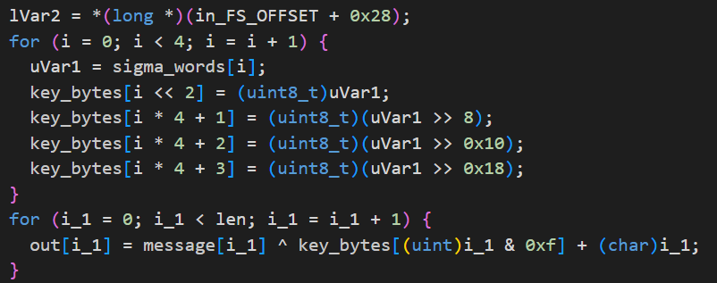
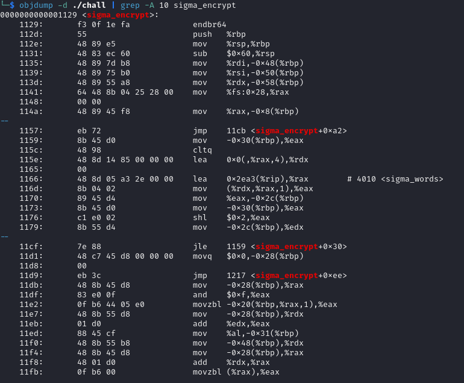
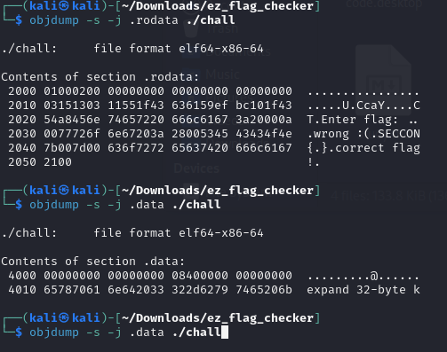
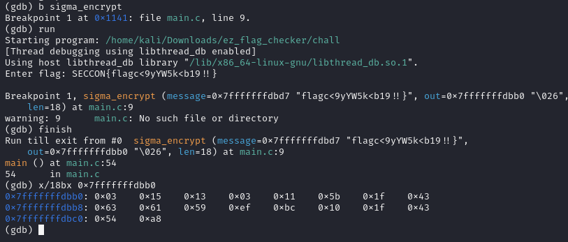

# Ez Flag Checker
59 points

---

## Write Up

### 準備
```chall```というELF実行ファイル一つだけ配られる。
実行すると、
```
Enter flag:
```
と入力を求められる。 

### 逆コンパイル
[Decompiler Explorer](https://dogbolt.org/)で逆コンパイルする。

```
💡GhidraやIDA Proでも良い
```
[結果はこちら](./decomp.c)

### 解析
とりあえずmain関数を追うと、flagと比較している箇所が見つかる。

SECCON{}の中身は```sigma_encrypt```で暗号化された後、```flag_enc```と比較されている。ということは```flag_enc```を```sigma_encrypt```の逆関数にかけるとフラグが得られる。
次に関数の中を見てみる。

ここが計算部分であり、同じ関数適用することでフラグを復元できる。
あとは```sigma_words```と```flag_enc```の場所を特定する。
sigma_wordsの先頭アドレスを特定するために
```
objdump -d chall | grep -A 10 sigma_encrypt
```
を実行するとsigma_wordsがメモリの4010に割り当てられていることが分かった。

```.data```セクションを見に行くと


ここから16bytes読み取ると```expand 32-byte k```がsigma_wordsに代入されている。
同様にmain関数をobjdumpで見ると2010に```flag_enc```があることがわかる。
```
uint8_t: 8ビット整数(0-255)
objdump: ディスアセンブルするツール
    -d <ファイル名>                    コードの表示
    -s -j <セクション名> <ファイル名>   セクションの表示
```

solve.py を実行してフラグを得る。
```
SECCON{flagc<9yYW5k<b19!!}
```
と思ったのだが何度提出してもIncorrectになる。
そこで検証として、gdbでデバッグして動的に暗号化した値を取得しようと考えた。

```sigma_encrypt```にブレークポイントを貼ってoutの値が関数終了後にどうなるのか調べたら、```0x55```だと思っていた場所が```0x5b```になっていた。

なのでヤケクソで```0x5b```に変えてフラグを提出したらCorrectになった。

どゆこと？
```
SECCON{flagc29yYW5k<b19!!}
```